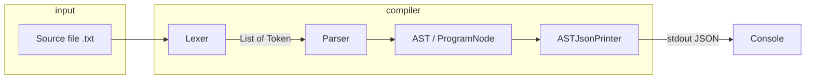

# Boolean Rule Language — Project Guide (Java)

This document explains how the **Boolean Rule Language** compiler in this repository works end to end: what the language accepts, how the code is organized, how scanning and parsing proceed, what the abstract syntax tree (AST) looks like, and what is **not** implemented yet. Use it as a map for adding features (interpreter, types, new syntax, and so on).

---

## 1. What this project is

This is a small **domain-specific language (DSL)** focused on **boolean logic, comparisons, and arithmetic**, implemented as a **pipeline**:

1. **Lexer (scanner)** — reads a source file and produces a list of `Token`.
2. **Parser** — recursive-descent parser that builds an **AST** (`ProgramNode` and nested `Node` types).
3. **AST visitor** — today the only concrete visitor is **`ASTJsonPrinter`**, which prints the AST as pretty JSON to standard output.

There is **no interpreter or evaluator** in the current codebase: assignments and `print` are parsed into the tree, but **nothing executes** expressions or maintains variables at runtime. The “compiler” stops after **parse + pretty-print**.

The app is a **Spring Boot** command-line program: Spring wires `Lexer`, `Parser`, and `ASTJsonPrinter` into `CompilerEngine`, and `BooleanRuleLangApplication` implements `CommandLineRunner` to run one compilation when the process starts.

---

## 2. How to run it (current project)

> **Note:** The root `README.md` still mentions `com.booleanrulelanguage.Main` and a different JAR name; the real entry point is `com.booleanrulelang.BooleanRuleLangApplication`.

**Prerequisites:** JDK compatible with `pom.xml` (`java.version` is **25**), Maven.

**Usage:** pass the path to a **source file** as the first program argument.

Examples:

```bash
mvn -q spring-boot:run -Dspring-boot.run.arguments="docs/test.txt"
```

After `mvn package`, you can run the packaged JAR and pass the file path (Spring Boot fat JAR):

```bash
java -jar target/Boolean-rule-lang-0.0.1-SNAPSHOT.jar docs/test.txt
```

**Success output:** a message plus an indented JSON representation of the AST.

**Failure:** `CompilerException` subclasses print a formatted error; the process exits with a non-zero code (see `CompilerException.getExitCode()`).

---

## 3. Language syntax (informal grammar)

### 3.1 Programs and statements

A program is a sequence of statements until end of file.

- **Assignment:** `identifier := expression ;`
- **Print:** `print expression ;`

Only two statement forms exist. Every statement ends with `;`.

### 3.2 Expressions and operator precedence

The parser uses **recursive descent** with the following precedence (from **lowest** to **highest** binding strength):

| Level | Operators / form | Associativity / notes |
|-------|------------------|------------------------|
| 1 | `or` | Left-associative chain |
| 2 | `and` | Left-associative chain |
| 3 | `not` | Unary, **right-associative** (`not not x` parses as `not (not x)`) |
| 4 | `==` `!=` `<` `>` `<=` `>=` | **Non-chaining:** at most **one** comparison per subexpression (see below) |
| 5 | `+` `-` | Left-associative |
| 6 | `*` `/` | Left-associative |
| 7 | Unary `-` | Applies to the following primary |
| 8 | Primary | Literals, identifiers, `( expression )` |

**Keywords:** `and`, `or`, `not`, `true`, `false`, `print` (scanner maps these by spelling, case-insensitive for keyword detection — see lexer).

**Comparison limitation:** After parsing the left side as arithmetic, the parser optionally consumes **one** comparison operator and **one** right-hand arithmetic operand. It does **not** parse chains like `a < b < c`; `c` would be left over or cause a later error.

### 3.3 Literals and identifiers

- **Numbers:** non-negative integer literals (sequence of digits), stored in the AST as `double` (`NumberNode`).
- **Booleans:** `true`, `false`.
- **Identifiers:** one or more **letters only** (`A–Z`, `a–z`). Underscores and digits inside names are **not** supported by the lexer.

### 3.4 Comments

There is **no** comment syntax; any unsupported character triggers a lexer error.

---

## 4. Scanner (`Lexer`)

**File:** `src/main/java/com/booleanrulelang/scanner/Lexer.java`

**Responsibilities:**

- Read the file with a `PushbackReader` so it can peek one character ahead for multi-character operators (`:=`, `==`, `!=`, `>=`, `<=`).
- Track **line numbers** (increment on `\n`) for tokens and errors.
- Skip whitespace.
- Recognize punctuation and operators (`( ) ; + - * /` and comparison/assign tokens above).
- Read numbers and identifiers.
- Map identifier spellings to keywords via a static map; **keyword lookup uses the lowercased word**, so `AND`, `And`, `and` all become `TokenType.AND`.

**Important lexer rules:**

- A single `=` alone is **invalid**; `==` is required for equality. Otherwise `UnrecognizedText` is thrown.
- `:` not followed by `=` does not produce a token (the `:` is silently skipped in the current code — worth knowing if you add labels or types later).
- `!` not followed by `=` will **unread** the next character and fall through; if that does not match another branch, you may get `UnrecognizedText` for `!`.

**Output:** `List<Token>` terminated by `TokenType.EOF`.

**Errors:** `UnrecognizedText` (bad character), or `SourceFileException` if the file cannot be read.

---

## 5. Parser (`Parser`)

**File:** `src/main/java/com/booleanrulelang/parser/Parser.java`

**Responsibilities:**

- Consume the token list and build a `ProgramNode` containing statement nodes (`AssignNode`, `PrintNode`) and expression nodes (`BinaryOpNode`, `UnaryOpNode`, `NumberNode`, `IdentifierNode`, `BoolNode`).

**Parsing methods mirror the precedence table:**

- `parseStatement` → `parsePrint` or `parseAssignment`
- `parseExpression` → `parseLogicOr`
- `parseLogicOr` / `parseLogicAnd` → binary `or` / `and`
- `parseLogicNot` → `not` prefix recursion
- `parseComparison` → optional single relational/equality operator between two arithmetic sides
- `parseArithmetic` / `parseTerm` → `+ -` / `* /`
- `parseFactor` → unary minus
- `parsePrimary` → number, identifier, boolean, or parenthesized expression

**Errors:**

- `StatementException` — token at statement start is neither `print` nor an identifier.
- `SyntaxException` — `expect` failed (wrong token where a specific one was required).
- `UnexpectedTokenException` — invalid start of a primary expression.

**Note:** There is a `//todo: handle exceptions` in the parser; some failure paths rely on unchecked exceptions bubbling up.

---

## 6. Abstract syntax tree (AST)

### 6.1 Base type and visitor pattern

- **`Node`** — abstract; defines `abstract <T> T accept(ASTVisitor<T> visitor)`.

**Visitors** allow you to **add operations** without changing every node class again (evaluation, type checking, code generation, optimization passes, etc.).

**Interface:** `src/main/java/com/booleanrulelang/visitor/ASTVisitor.java`

Each concrete node implements `accept` by dispatching to the matching `visit…` method.

### 6.2 Node kinds

| Class | Meaning | Important fields |
|-------|---------|------------------|
| `ProgramNode` | Whole program | `List<Node> statements` |
| `AssignNode` | Assignment | `String name`, `Node value` |
| `PrintNode` | Print statement | `Node expression` |
| `BinaryOpNode` | Binary operator | `String op` (`"and"`, `"or"`, `"+"`, `"=="`, …), `Node left`, `Node right` |
| `UnaryOpNode` | Unary operator | `String op` (`"not"` or `"-"`), `Node operand` |
| `NumberNode` | Numeric literal | `double value` |
| `IdentifierNode` | Variable reference | `String name` |
| `BoolNode` | Boolean literal | `boolean value` |

Operators are carried as **strings** in `BinaryOpNode` / `UnaryOpNode`, matching the lexical form (`or`, `and`, `not`, `-`, relational symbols, etc.).

### 6.3 JSON emission (`ASTJsonPrinter`)

**File:** `src/main/java/com/booleanrulelang/visitor/ASTJsonPrinter.java`

Implements `ASTVisitor<JSONObject>` (org.json). The compiler prints `astJsonPrinter.print(ast).toString(2)` (two-space indent).

**Shape (examples):**

- Program: `{ "type": "Program", "body": [ ... ] }`
- Assignment: `{ "type": "Assign", "name": "...", "value": { ... } }`
- Print: `{ "type": "Print", "expression": { ... } }`
- Binary: `{ "type": "BinaryOp", "op": "...", "left": { ... }, "right": { ... } }`

**Number formatting:** whole doubles are emitted as integers in JSON for readability.

---

## 7. Compiler orchestration (`CompilerEngine`)

**File:** `src/main/java/com/booleanrulelang/compilerEngine/CompilerEngine.java`

```text
compile(filePath):
  tokens = lexer.scan(filePath)
  ast    = parser.parseProgram(tokens)
  print JSON(AST)
```

This is the right place to **insert new phases**: semantic analysis, evaluation, bytecode, IR, etc.

---

## 8. Application entry (`BooleanRuleLangApplication`)

**File:** `src/main/java/com/booleanrulelang/BooleanRuleLangApplication.java`

- Spring Boot `@SpringBootApplication`.
- Injects `CompilerEngine`.
- `run(String... args)`: requires at least one argument (source path); calls `compilerEngine.compile`.
- Maps `CompilerException` to stderr + `System.exit(exitCode)`; rethrows `SourceFileException` (you may want to align this with other errors).
- Catches generic `Exception` as “Internal Compiler Error”.

---

## 9. Errors and exit codes

**Base:** `CompilerException` — holds `exitCode`, `line`, `column` (several subclasses pass `0, 0` for column/line in the parent; **line is often embedded in the message string** instead).

**Subclasses:**

- `SourceFileException` — I/O or missing file.
- `UnrecognizedText` — illegal character for the lexer.
- `SyntaxException` — parse expectation failed.
- `StatementException` / `UnexpectedTokenException` — wrong token class at statement or primary start.

`getFormattedMessage()` uses `line` and `column` from the parent fields; for many parse errors those fields are `0`, so the human-readable detail is often **only** in the message text.

---

## 10. Project layout (source)

```text
src/main/java/com/booleanrulelang/
  BooleanRuleLangApplication.java    # CLI entry (Spring)
  compilerEngine/CompilerEngine.java # scan → parse → print
  scanner/Lexer.java                 # tokenizer
  parser/Parser.java                 # recursive descent
  domain/                            # Token, TokenType, AST nodes
  visitor/ASTVisitor.java, ASTJsonPrinter.java
  exception/                         # error types
```

**Tests:** `src/test/java/.../BooleanRuleLangApplicationTests.java` only loads the Spring context; there are **no** parser/lexer unit tests in the tree yet.

**Dependencies (high level):** Spring Boot starter, Lombok, `org.json`, JUnit (via spring-boot-starter-test).

---

## 11. Architecture overview



---

## 12. Semantic gap (what the language *allows* vs. what is *meaningful*)

The grammar **mixes** booleans, numbers, and comparisons freely at the syntax level. There is **no type checker**, so programs like `x := true + 5;` **parse** successfully even though they are not meaningful for a typical boolean/numeric algebra until you define rules.

When you add features, you will likely want:

- A **type system** or **dynamic runtime** rules for `+`, `*`, `and`, etc.
- **Runtime values** (number vs boolean) and **environments** (variable store) for assignments.
- **Actual `print` execution** that walks the tree and prints evaluated results.

---

## 13. Practical extension checklist

When you add a feature, touch only the layers it needs:

| Feature idea | Typical touch points |
|--------------|----------------------|
| New keyword / operator | `TokenType`, `Lexer` (and maybe keyword map), `Parser`, new or existing `Node`, `ASTVisitor` + all visitors |
| New statement (`if`, `while`, …) | `Parser.parseStatement`, new `Node`, visitor methods, printer |
| Evaluate / interpret | New class e.g. `Interpreter implements ASTVisitor<Object>` (or typed), environment `Map<String, Value>`, wire in `CompilerEngine` |
| Type checking | New visitor; report errors instead of building output |
| Better errors (column, spans) | Lexer: track column; Token: store start/end; exceptions: use them |
| Comments / strings | Lexer states; new token types |
| Identifiers with digits `_` | `readIdentifier` character rules |

Every new `Node` type requires **updating `ASTVisitor`** and **every implementor** (today only `ASTJsonPrinter`).

---

## 14. Sample program

**File:** `docs/test.txt`

```text
x := true + 5;
```

This illustrates the **lack of semantic validation**: it is valid syntax for assignment and expression parsing. Your job in a follow-up feature might be to reject or define behavior for `true + 5`.

---

## 15. Summary

- The **Boolean Rule Language** in this repo is implemented as a **lexer + recursive-descent parser + AST visitor (JSON printer)**.
- **Precedence** favors logical `or`/`and`/`not` below comparison, with arithmetic and unary minus below `not` but above primaries — see the parser method layering for the exact order.
- The **Spring Boot** shell runs **one compile** from a file path argument and prints the AST.
- **Execution (variables, print output of values, types)** is the natural next layer for collaboration: add a new visitor and call it from `CompilerEngine`.

This guide is the canonical high-level reference for navigating the codebase and planning new work.
